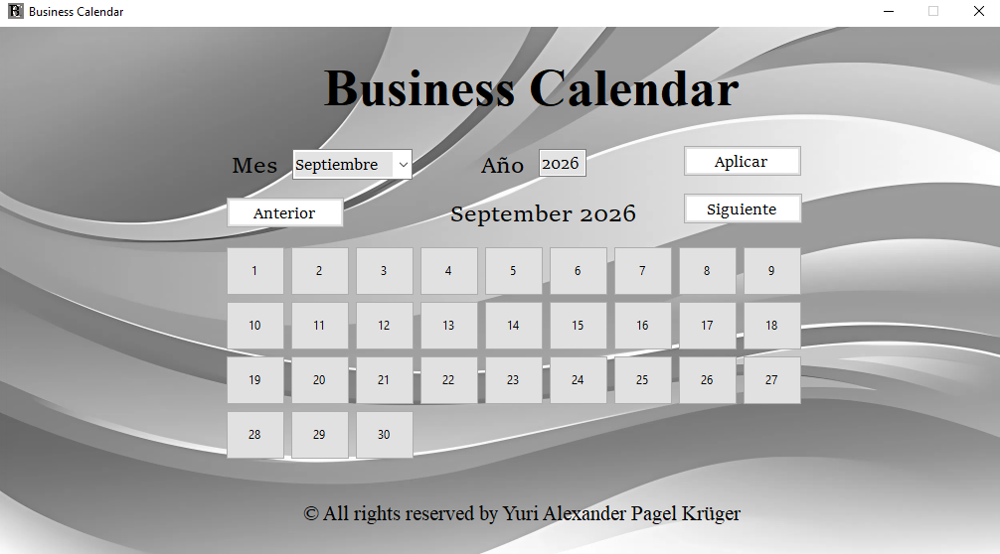

# 📅 Business Calendar

**Business Calendar** es una aplicación de escritorio desarrollada en Visual Basic .NET, diseñada para ofrecer una vista de calendario rápida, clara y con una estética corporativa. 

A diferencia de los calendarios genéricos y monótonos del sistema operativo, este proyecto propone una interfaz personalizada con un fondo abstracto plateado y controles de navegación intuitivos, ideal para integrarse visualmente en entornos de trabajo y oficinas.

## 📸 Captura de pantalla

*Interfaz principal mostrando la cuadrícula dinámica generada para el mes seleccionado.*

## ✨ Características Principales

- **Navegación Intuitiva:** Botones de acceso rápido (`Anterior` y `Siguiente`) para hojear los meses de forma fluida sin tener que escribir.
- **Búsqueda Específica:** Selector desplegable de meses y un campo de año para saltar instantáneamente a cualquier fecha en el tiempo usando el botón `Aplicar`.
- **Diseño Corporativo:** Interfaz gráfica personalizada con un fondo abstracto de ondas y una paleta de colores monocromática que transmite profesionalidad y limpieza.
- **Cuadrícula Dinámica:** Los paneles de los días se generan y organizan dinámicamente en una cuadrícula flotante (efecto sombra/relieve) que se adapta con exactitud matemática a los días del mes y año seleccionados.

## ⚙️ ¿Cómo funciona? (Mecánica lógica)

La aplicación calcula automáticamente la disposición de los días basándose en el calendario gregoriano. Al seleccionar un mes (ej. Septiembre) y un año (ej. 2026), el motor lógico en VB.NET:
1. Determina cuántos días tiene ese mes específico (detectando automáticamente los años bisiestos).
2. Averigua en qué día de la semana cae exactamente el día 1 de ese mes.
3. Dibuja y posiciona los paneles numéricos en la ventana de forma estructurada para que coincidan con los días reales de la semana.

## 🛠️ Tecnologías Utilizadas

- **Lenguaje:** Visual Basic .NET (VB.NET)
- **Framework Gráfico:** Windows Forms (.NET Framework)
- **Entorno de desarrollo:** Visual Studio

## 🚀 Instalación y Uso

1. Descarga el instalador desde la sección de **Releases**.
2. Haz doble clic en `Business-Calendar-v1.0.0-Setup.exe` e instalo.
3. Una vez instalado abre el programa, utiliza el menú desplegable superior para cambiar de mes, o teclea el año deseado y presiona **Aplicar**.

## 👨‍💻 Autor

Creado por **Yuri Alexander Pagel Krüger**
